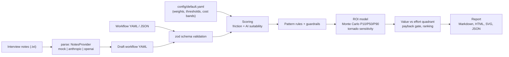

# workflow-radar

[](https://github.com/seanmcrae/workflow-radar/actions/workflows/ci.yml)
[](https://seanmcrae.github.io/workflow-radar/)
[](LICENSE)
[](package.json)

Decide which AI initiatives to fund first, and which to drop, from how your workflows actually run: workflow-radar ranks every workflow step by measured friction, AI suitability, and Monte Carlo ROI, and shows the arithmetic behind each score.

**Live docs:** [seanmcrae.github.io/workflow-radar](https://seanmcrae.github.io/workflow-radar/): results, the full sample report, architecture, and the product brief.

A command-line tool for running an AI-opportunity audit of business workflows. You describe each workflow as a list of steps (who does it, how long it takes, how often it is redone, how many handoffs, what data it uses, how much judgment and regulatory exposure it carries), and workflow-radar scores friction and AI suitability, recommends a delivery pattern with guardrails, estimates ROI as a P10/P50/P90 range with a seeded Monte Carlo simulation, and writes a prioritized roadmap as Markdown, self-contained HTML, SVG, and JSON. Every score is a transparent weighted sum whose weights live in a config file, and every number in the report can be traced back to the inputs that produced it. The aim is to pick AI initiatives by measured friction and expected value rather than by whichever demo was most impressive.

## Numbers

On the bundled **synthetic** workflows with the default config. `tests/readme-numbers.test.ts` recomputes every figure here from the code on each CI run.

|          |                                                                                                                                                                                                                           |
| -------- | ------------------------------------------------------------------------------------------------------------------------------------------------------------------------------------------------------------------------- |
| Headline | Top 6 by workflow-radar (Now + Next): **$713,759** summed P50 first-year net savings, 8.2x the baseline                                                                                                                   |
| Baseline | Top 6 by friction score alone: **$87,518**. This is "fund what hurts most", the usual way such lists get ranked. 3 of those 6 lose money at P50 or are not recommended at all, and 1 overlaps with workflow-radar's top 6 |
| Eval set | 4 synthetic workflows, 23 human steps (2 system steps skipped), 5,000 Monte Carlo iterations per step, seed 42                                                                                                            |
| Not here | Latency and cost per request. The default path is an offline CLI that makes no model calls, and the optional hosted parse providers have not been benchmarked                                                             |

Totals are sums of per-opportunity medians, not a percentile of the portfolio, and the workflows are invented. Read the gap between the two rankings, not the dollar amounts.


Marker size is P50 hours saved per month; hollow markers are opportunities parked because their median payback exceeds the 18-month horizon. The chart is generated in code as inline SVG (no charting library, no CDN).

## Quickstart

Requires Node.js 20 or later. One command installs, builds, and audits the bundled examples into `report/`:

```bash
git clone https://github.com/seanmcrae/workflow-radar.git && cd workflow-radar
npm ci && npm run demo
```

Then run the commands individually:

```bash
# Score one workflow step by step (add --explain for factor-level detail)
node dist/cli.js score examples/invoice.yaml

# Audit all bundled examples and write report/report.{md,html}, quadrant.svg, audit.json
node dist/cli.js report examples/*.yaml --out report

# Draft a workflow YAML from free-text interview notes (offline heuristic parser by default)
node dist/cli.js parse examples/notes/invoice-interview.txt --out draft.yaml
```

After `npm link` (or a global install) the same commands are available as `audit score ...` / `workflow-radar score ...`. `npm run sample` regenerates the committed sample report and `npm run site` builds the documentation site into `site/`.

## Features

- **Validated workflow model.** YAML or JSON, checked by zod; every uncertain input can be a three-point range; unknown keys and out-of-range values fail with field paths.
- **Explainable scores.** Friction and AI suitability are weighted sums whose weights live in config; every factor's points and a one-line reason are in the output.
- **Pattern rules with guardrails.** Copilot, automation with review, or agent, chosen by ordered hard rules (task type, regulation, judgment) before any threshold, with guardrail notes for risky steps.
- **Monte Carlo ROI.** Seeded triangular sampling gives P10/P50/P90 hours saved, net savings, payback, and the probability that first-year net is positive.
- **Sensitivity.** One-at-a-time tornado analysis shows which input moves the answer, so the team knows what to measure before funding.
- **Roadmap.** Value-versus-effort quadrants plus a payback gate produce a ranked Now / Next / Later / Park plan.
- **Interview-notes parser.** Offline heuristic parser by default; Anthropic and OpenAI adapters behind one interface, opt-in by API key.
- **Portable, reproducible reports.** Markdown, self-contained HTML, SVG, and JSON; the same inputs and seed produce byte-identical files.

## Example output

All output below was produced by the commands shown, on the bundled **synthetic** example workflows (`examples/*.yaml`). The numbers illustrate the method; they are not measurements of any real organization.

`node dist/cli.js report examples/*.yaml --out report`:

```text
Assessed 23 human steps across 4 workflows (4 synthetic); 21 recommended, 2 not recommended.

Phase   #  Opportunity                                                                 Hours/mo P50  1st-yr net P50  Payback P50
-----  --  --------------------------------------------------------------------------  ------------  --------------  -----------
Now     1  Customer support triage: Draft first response                                        837        $333,756       1.2 mo
Now     2  Customer support triage: Read new ticket and tag product area and intent             359        $114,925       3.0 mo
Now     3  Sales proposal drafting: Draft proposal narrative and scope                          105         $72,012       4.2 mo
Now     4  Invoice processing: Key invoice header and line items into the ERP                   176         $66,135       4.5 mo
Now     5  Customer support triage: Escalate to Tier 2 with a case summary                      208         $46,037       5.4 mo
Next    6  Customer support triage: Look up customer account and order history                  283         $80,893       3.9 mo
Later   7  Sales proposal drafting: Answer customer security questionnaire                       31         $18,327       5.1 mo
Later   8  Customer support triage: Set priority and route to the right queue                   131         $10,437       9.4 mo
Later   9  Sales proposal drafting: Map customer requirements to product capabilities            50          $8,549       9.8 mo
Later  10  Invoice processing: Resolve three-way match exceptions                                37          $7,480       7.7 mo
Later  11  Sales proposal drafting: Build pricing and approve discounts                          14            -$31      12.0 mo
Later  12  Customer support triage: Decide on refund or goodwill credit                          32         -$2,138      14.2 mo
Later  13  Invoice processing: Assign GL codes and cost centers                                  64         -$6,822      14.6 mo
Park   14  Invoice processing: Approve invoices above the $5,000 threshold                       15         -$7,202      26.0 mo
Park   15  Employee onboarding: Collect and verify new-hire documents                             9        -$11,339      76.2 mo
Park   16  Employee onboarding: Enter new hire into payroll                                       4        -$14,436   no payback
Park   17  Invoice processing: Download invoice attachments from the AP inbox                    37        -$24,875      33.9 mo
Park   18  Employee onboarding: Answer policy and benefits questions                             30        -$30,957      58.5 mo
Park   19  Sales proposal drafting: Summarize discovery call notes                               12        -$35,001     116.7 mo
Park   20  Employee onboarding: Draft a personalized first-week plan                             19        -$37,344     > 120 mo
Park   21  Employee onboarding: Request accounts and access for each system                      22       -$114,258   no payback

Wrote report/report.md, report/report.html, report/quadrant.svg, report/audit.json
```

`node dist/cli.js score examples/invoice.yaml`:

```text
Invoice processing (Accounts Payable) [synthetic data]
Volume 1,800 (1,500–2,200) / month · workflow friction 16.8

#  Step                                            Task type       Friction  Suitability  Pattern                 Hours/mo P50  Payback P50
-  ----------------------------------------------  --------------  --------  -----------  ----------------------  ------------  -----------
1  Download invoice attachments from the AP inbox  extraction             3           87  Automation with review            37      33.9 mo
2  Key invoice header and line items into the ERP  extraction            17           84  Automation with review           176       4.5 mo
3  Assign GL codes and cost centers                classification        10           84  Automation with review            64      14.6 mo
4  Resolve three-way match exceptions              decision              35           55  Copilot                           37       7.7 mo
5  Approve invoices above the $5,000 threshold     decision              30           50  Copilot                           15      26.0 mo
6  Scheduled payment run                           -                      -            -  system step (skipped)              -            -
```

`--explain` shows where each score comes from:

```text
2. Key invoice header and line items into the ERP
   friction 16.7:
     time           +  4.7  8 min hands-on per run (saturates at 60)
     rework         + 12.0  12% of runs need rework (saturates at 25%)
     handoffs       +  0.0  0 handoffs (saturates at 4)
     wait           +  0.0  0 min waiting (saturates at 1440)
   suitability 83.5:
     taskType       + 31.5  extraction (inferred from "key")
     dataReadiness  + 15.0  data readiness medium
     judgment       + 20.0  low judgment required
     risk           + 17.0  regulatory sensitivity low
   pattern: Automation with review. Suitability 84 supports automation with human review of exceptions.
   guardrail: Route low-confidence outputs to a review queue and sample-audit a fixed share of auto-accepted items.
```

The full generated report is committed under [`docs/sample-report/`](docs/sample-report/): [`report.md`](docs/sample-report/report.md), [`report.html`](docs/sample-report/report.html) (open locally; it has no external dependencies), and the machine-readable [`audit.json`](docs/sample-report/audit.json).

One pattern the synthetic data makes visible: the steps with the highest per-run friction (legal review, document collection, pricing approval, all around 60) are not the best AI opportunities. Low-friction steps at high volume (support replies at 12,000 tickets a month) dominate value, while the high-friction steps are blocked by judgment, regulation, or low volume. That gap between "feels painful" and "pays back" is the reason the tool scores friction, suitability, and value separately.

## Results

Now and Next opportunities on the bundled **synthetic** workflows (`examples/*.yaml`), default config, 5,000 Monte Carlo iterations per opportunity, seed 42. Copied from [`docs/sample-report/audit.json`](docs/sample-report/audit.json), which `npm run sample` regenerates; the [live docs](https://seanmcrae.github.io/workflow-radar/#results) rebuild this table from the code on every push.

| #   | Phase | Opportunity                                                              | Pattern                | Hours/mo P50 | First-year net P10 / P50 / P90 | Payback P50 | P(net > 0) |
| --- | ----- | ------------------------------------------------------------------------ | ---------------------- | -----------: | -----------------------------: | ----------: | ---------: |
| 1   | Now   | Customer support triage: Draft first response                            | Automation with review |          837 | $225,482 / $333,756 / $480,520 |      1.2 mo |       100% |
| 2   | Now   | Customer support triage: Read new ticket and tag product area and intent | Automation with review |          359 |  $64,345 / $114,925 / $179,487 |      3.0 mo |       100% |
| 3   | Now   | Sales proposal drafting: Draft proposal narrative and scope              | Automation with review |          105 |   $32,811 / $72,012 / $121,176 |      4.2 mo |       100% |
| 4   | Now   | Invoice processing: Key invoice header and line items into the ERP       | Automation with review |          176 |   $34,643 / $66,135 / $102,980 |      4.5 mo |       100% |
| 5   | Now   | Customer support triage: Escalate to Tier 2 with a case summary          | Automation with review |          208 |    $13,766 / $46,037 / $87,352 |      5.4 mo |        97% |
| 6   | Next  | Customer support triage: Look up customer account and order history      | Automation with review |          283 |   $41,518 / $80,893 / $129,156 |      3.9 mo |       100% |

Of the remaining steps, 7 are Later (fill-ins), 8 are parked, and 2 are not recommended at all. These figures illustrate the method on invented data; they are not measurements of any real organization.

## How evaluation works

Each human step is scored independently, then ranked:

1. **Friction (0-100)** is a weighted average of hands-on minutes, rework rate, handoffs, and wait time, each normalized against a saturation point (60 minutes, 25% rework, 4 handoffs, 1,440 minutes by default).
2. **AI suitability (0-100)** is a weighted average of task-type fit (extraction and classification high, decisions low), data readiness, judgment (inverted), and regulatory sensitivity (inverted).
3. **Pattern** comes from ordered hard rules first (no AI-shaped task, or suitability below the minimum, means not recommended; high regulation, high judgment, or a decision task caps the step at copilot), then suitability thresholds.
4. **ROI** samples every three-point input from a triangular distribution: hours saved = volume x share of runs x minutes x (1 + rework rate) / 60 x automation fraction, and first-year net = 12 x (hours saved x loaded hourly cost - monthly run cost) - implementation cost. Each opportunity gets its own seeded stream, so adding a workflow never changes another's numbers.
5. **Prioritization** maps P50 annual net savings to a value score, combines pattern, data readiness, regulation, and system count into an effort score, places each step in a quadrant, and parks anything whose median payback exceeds the horizon.

How the tool checks itself, in this repository:

- Scoring math is pinned by unit tests with hand-computed expected values (friction, suitability, effort, quadrant edges, value cap).
- Monte Carlo tests cover determinism per seed, percentile ordering, degenerate ranges collapsing to the point estimate, and the triangular sampler's mean.
- The heuristic parser is evaluated field by field against synthetic interview notes and must produce a schema-valid workflow.
- Hosted LLM adapters are tested against recorded-shape responses through an injected `fetch`, including HTTP errors and malformed content.
- CLI integration tests run `score`, `report`, and `parse` in-process and require byte-identical reports for a fixed seed; the site build test requires the embedded report to equal the committed sample.
- `tests/readme-numbers.test.ts` recomputes the Numbers card, including the friction-only baseline, and the figures in [Where it fails](#where-it-fails), so the README cannot drift from the code.

How a team would measure it in use (estimate accuracy, interval calibration, draft acceptance rate) is defined in [docs/PRODUCT.md](docs/PRODUCT.md#success-metrics-and-evals).

## Where it fails

The sample audit is the eval, so its weak spots are the failure modes worth knowing. They split into limits of the data the model is fed and limits of how the model is built.

**Data and estimate limits**

| Failure mode or slice               | Evidence                                                                                                                          | Effect                                                                                                                                        |
| ----------------------------------- | --------------------------------------------------------------------------------------------------------------------------------- | --------------------------------------------------------------------------------------------------------------------------------------------- |
| No realized outcomes                | Every input is an invented interview estimate; nothing in the repo compares a P50 with what a launched opportunity actually saved | Estimate accuracy and interval calibration, the two metrics in [docs/PRODUCT.md](docs/PRODUCT.md) that matter most, are unmeasured            |
| Parser tested on one interview      | `tests/parse-heuristic.test.ts` checks a single synthetic transcript field by field                                               | No per-field precision or recall, so the 70% draft-acceptance target is untested ([#7](https://github.com/seanmcrae/workflow-radar/issues/7)) |
| Biased inputs pass straight through | Ranges widen the interval but stay centred on what people report                                                                  | If everyone under-reports rework, every opportunity is undervalued by the same bias and the ranking cannot show it                            |

**Design and scaffolding limits**

| Limit                   | Evidence in the sample audit                                                                                                                              | Effect                                                                                                                                                                                 |
| ----------------------- | --------------------------------------------------------------------------------------------------------------------------------------------------------- | -------------------------------------------------------------------------------------------------------------------------------------------------------------------------------------- |
| Keyword task classifier | "Request accounts and access for each system" is read as classification from the word "route" in its description: suitability 92, recommended as an agent | The score and pattern on that step are wrong; it is parked only because it never pays back (P50 first-year net -$114,258) ([#6](https://github.com/seanmcrae/workflow-radar/issues/6)) |
| Per-step build cost     | Employee onboarding at 40 hires a month: 0 of 6 steps reach Now or Next; 5 parked, 1 not recommended                                                      | Low-volume workflows only pay back if adjacent steps share one build, which the model does not credit                                                                                  |
| Additive suitability    | "Order laptop and ship equipment" scores 69 on suitability with no AI-shaped task in it                                                                   | The score alone would mislead; the not-recommended gate catches it and names itself in the rationale                                                                                   |
| Independent sampling    | Volume, duration, and rework are drawn separately                                                                                                         | Tails are too narrow where inputs move together, and portfolio totals can only be sums of medians                                                                                      |

**Considered and rejected.** A pure value-versus-effort grid. On this data it put steps with a 30+ month payback into Fill-ins, so a payback gate now parks anything whose median payback exceeds 18 months, and the chart draws those steps hollow so the override stays visible. A learned ranking model was rejected as well: there is no labelled outcome data to train it on, and finance and risk reviewers need weights they can argue with. Both are written up under trade-offs in [docs/PRODUCT.md](docs/PRODUCT.md#trade-offs-and-alternatives-considered).

## Limitations

- **Inputs are estimates from interviews.** The model is only as good as the minutes and volumes people report; the ranges help, but systematic bias (everyone underestimating rework) is not corrected.
- **Inputs are sampled independently.** Real volume and duration often correlate, which would widen the tails. Portfolio totals in the report are sums of per-opportunity medians, not a percentile of the portfolio.
- **Opportunities are per step.** Automating two adjacent steps together usually shares build cost; the model charges each step its own band.
- **Automation fractions and cost bands are defaults, not benchmarks.** They are deliberately round numbers meant to be replaced with an organization's own figures.
- **The task-type classifier is keyword-based.** It explains its matches and can be overridden per step with `taskType`, but it will misread unusual phrasing.
- **Labor savings are not cash savings.** Hours freed only become money if the capacity is redeployed or hiring is avoided; the report labels figures as savings, not budget cuts.

## Workflow format

```yaml
# SYNTHETIC example
id: invoice-processing
name: Invoice processing
team: Accounts Payable
synthetic: true
volumePerMonth: { low: 1500, likely: 1800, high: 2200 } # any number can be a three-point range
loadedHourlyCost: { low: 48, likely: 55, high: 62 }
steps:
  - id: match-exceptions
    name: Resolve three-way match exceptions
    description: Investigate mismatches, email purchasing, and decide whether to hold or adjust.
    actor: AP specialist
    volumeShare: { low: 0.12, likely: 0.18, high: 0.25 } # share of runs that reach this step
    durationMinutes: { low: 10, likely: 15, high: 30 } # hands-on time per run
    waitMinutes: { low: 240, likely: 480, high: 1440 } # queue time; friction only, not labor
    errorRate: 0.1 # share of runs redone
    handoffs: 2
    dataInputs: [{ name: purchase order, format: structured }]
    systems: [SAP, Outlook]
    judgmentLevel: medium # low | medium | high
    regulatorySensitivity: low # none | low | medium | high
    dataReadiness: medium # low | medium | high
    # taskType: decision             # optional; inferred from name/description when omitted
```

Files are validated with zod. Unknown keys are rejected (typos surface instead of silently defaulting) and errors carry field paths, for example `steps.0.errorRate: Too big: expected number to be <=1`. JSON input works the same way.

## Architecture



| Module           | Responsibility                                                                                           |
| ---------------- | -------------------------------------------------------------------------------------------------------- |
| `src/domain`     | zod schemas for workflows and steps, three-point estimates, YAML/JSON loading with path-qualified errors |
| `src/config.ts`  | Config schema, defaults (mirrored in `config/default.yaml`), deep-merge of partial overrides             |
| `src/scoring`    | Friction score, task-type classifier, AI suitability score; each returns per-factor contributions        |
| `src/roi`        | ROI equations, mulberry32 PRNG, triangular sampling, Monte Carlo summary, one-at-a-time tornado analysis |
| `src/prioritize` | Pattern recommendation, guardrail notes, effort score, quadrant placement, audit orchestration           |
| `src/parse`      | `NotesProvider` interface, deterministic heuristic parser, Anthropic and OpenAI adapters over `fetch`    |
| `src/report`     | Markdown and HTML renderers, inline SVG quadrant chart, JSON serialization                               |
| `src/cli`        | commander program; `run()` returns an exit code so the CLI is tested in-process                          |

## Design decisions

- **Transparent weighted sums over a learned model.** There is no labelled dataset of "AI projects that paid back" to train on, and the people who act on an audit need to argue with it. Every score is `sum(weight x normalized factor)`, the weights are in YAML, and each factor's points and a one-line reason are in the report.
- **Hard rules before thresholds.** Pattern selection checks task type, regulatory sensitivity, judgment, and decision tasks before it looks at the suitability score, so a high score cannot buy autonomy on a regulated or high-judgment step. Agents additionally require low risk, low judgment, at least two systems, and at least one handoff.
- **Ranges, not point estimates.** Volume, duration, rework, hourly cost, automation fraction, build cost, and run cost are all three-point ranges sampled as triangular distributions. The report shows P10/P50/P90 and the probability that first-year net is positive, so a fragile opportunity looks fragile.
- **Reproducible randomness.** Simulations use a seeded mulberry32 PRNG. Each opportunity's seed is the run seed XOR a hash of its id, so results do not change when workflows are added or reordered. Same inputs and seed produce byte-identical reports.
- **Rework is labor.** Hours saved use `minutes x (1 + rework rate)`, because a step redone 12% of the time costs 1.12x its nominal time.
- **Wait time is friction, not cost.** Queue time drives the friction score (it is what people complain about) but not labor savings, because nobody is paid to wait in a queue.
- **Value is net of run cost; build cost is effort.** The value axis uses P50 annual savings after model and maintenance costs; one-time build cost shows up in effort and payback. A payback gate then parks anything whose median payback exceeds the configured horizon, whatever its grid position.
- **LLM output is untrusted input.** The parse providers return a raw object that goes through the same zod schema as hand-written YAML, the prompt embeds the schema generated by `z.toJSONSchema`, and the offline heuristic parser is the default so nothing requires an API key.

## Interview notes parser

`parse` turns free-text notes into a draft workflow. Providers implement one method, `draft(notes) -> { workflow, warnings }`:

- `mock` (default): deterministic heuristics. Reads `Process:`, `Team:`, `Volume:`, and `Loaded cost:` lines and numbered or bulleted steps; extracts durations ("6-12 minutes"), wait times ("sits for a day"), rework ("12% need rework"), handoffs, known systems, data formats, judgment and regulatory cues. Missing values get a conservative default and a warning.
- `anthropic`: Messages API; needs `ANTHROPIC_API_KEY` (optional `ANTHROPIC_MODEL`).
- `openai`: Chat Completions in JSON mode; needs `OPENAI_API_KEY` (optional `OPENAI_MODEL`, `OPENAI_BASE_URL`).

Both hosted adapters call the HTTP APIs with `fetch`, so there are no SDK dependencies; tests inject a fake `fetch` and never touch the network. Drafts start with a comment block listing warnings and are meant to be reviewed before scoring.

## Configuration

`config/default.yaml` documents every knob: friction and suitability weights, saturation points, task-type fit, pattern thresholds, automation-fraction ranges, implementation and run-cost bands per pattern, effort penalties, quadrant thresholds, payback horizon, and simulation settings. Pass a partial override with `--config`; anything omitted falls back to the defaults:

```yaml
# stricter.yaml
patterns:
  thresholds: { minSuitability: 60 }
prioritization:
  maxPaybackMonths: 12
```

`--seed` and `--iterations` override the simulation settings for a single run.

## Project layout

```text
src/
  domain/       workflow and step schemas, three-point estimates, YAML/JSON loading
  scoring/      friction, task-type classifier, AI suitability
  roi/          ROI equations, seeded PRNG, Monte Carlo summary, tornado sensitivity
  prioritize/   pattern rules, guardrails, effort, quadrants, audit orchestration
  parse/        NotesProvider interface, heuristic parser, Anthropic and OpenAI adapters
  report/       Markdown, HTML, SVG, and JSON renderers
  cli/          commander program (score, report, parse)
config/         default.yaml: every weight, threshold, and cost band
examples/       synthetic workflows and interview notes
docs/           PRODUCT.md, generated sample report, chart
scripts/site/   static site generator for GitHub Pages (npm run site)
tests/          vitest unit and integration tests
```

## Development

```bash
npm ci
npm run lint          # eslint (typescript-eslint strict, type-checked)
npm run format:check  # prettier
npm run typecheck     # tsc --noEmit
npm test              # vitest
npm run demo          # build + full report on the synthetic examples
npm run site          # static site into site/, fully offline
```

`make check` runs lint, format check, type check, and tests; `docker build -t workflow-radar . && docker run --rm workflow-radar` runs the demo in a container. The `Pages` workflow builds the site on every push to `main` and publishes it to the `gh-pages` branch.

## Data

All bundled data is synthetic and labelled as such in each file (`synthetic: true` plus a header comment):

- `examples/invoice.yaml`, `support-triage.yaml`, `sales-proposal.yaml`, `employee-onboarding.yaml`: invented workflows with plausible but made-up volumes, durations, and costs.
- `examples/notes/invoice-interview.txt`: invented interview notes for the parser.

No external datasets are downloaded or required. The data and code are MIT-licensed.

## Roadmap

Product context, success metrics, trade-offs, and the now / next / later roadmap are in [docs/PRODUCT.md](docs/PRODUCT.md).

## How this was built

Code was written with AI coding agents under my direction. I set the problem, success metrics and eval gates, and decided what shipped. Every number here comes from the committed code and synthetic examples and is reproduced in CI: the site test regenerates the sample audit and checks it against the committed copy, and `tests/readme-numbers.test.ts` recomputes the Numbers card and the failure table.

## Contributing

See [CONTRIBUTING.md](CONTRIBUTING.md) for setup and conventions, [SECURITY.md](SECURITY.md) for reporting vulnerabilities, and [CHANGELOG.md](CHANGELOG.md) for release notes. If you reference this work, [CITATION.cff](CITATION.cff) has citation metadata.

## License

MIT. See [LICENSE](LICENSE).
