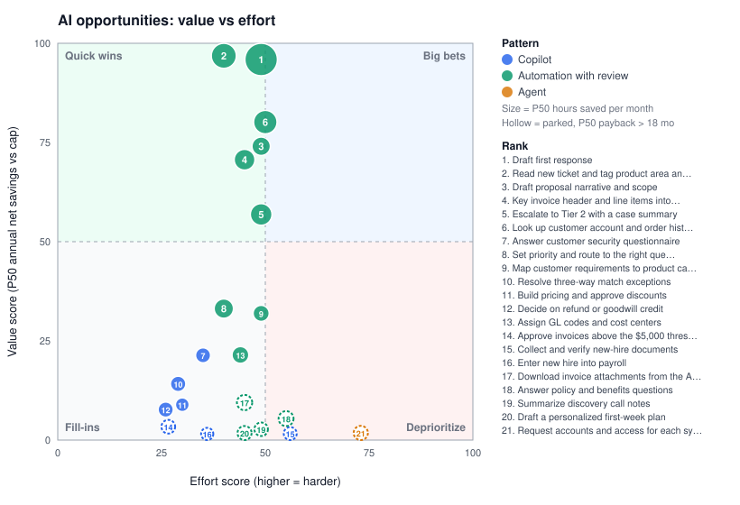

# AI Opportunity Audit

> **Synthetic data.** 4 of 4 workflows are marked synthetic. Figures illustrate the method and are not measurements of any real organization.

Generated by workflow-radar 0.1.0 from `examples/employee-onboarding.yaml`, `examples/invoice.yaml`, `examples/sales-proposal.yaml`, `examples/support-triage.yaml`. Monte Carlo: 5,000 iterations, seed 42.

## Summary

- 23 human steps assessed across 4 workflows; 21 recommended (Copilot: 7, Automation with review: 13, Agent: 1), 2 not recommended.
- Now + Next (6 opportunities): 1,968 hours saved per month and $713,759 first-year net, as sums of per-opportunity medians (not a portfolio percentile).

## Roadmap

### Now

Quick wins: high value, lower effort.

| # | Workflow | Step | Pattern | Value | Effort | Hours/mo P50 | First-year net P10 / P50 / P90 | Payback P50 | P(net > 0) |
| --- | --- | --- | --- | --- | --- | --- | --- | --- | --- |
| 1 | Customer support triage | Draft first response | Automation with review | 100 | 49 | 837 | $225,482 / $333,756 / $480,520 | 1.2 mo | 100% |
| 2 | Customer support triage | Read new ticket and tag product area and intent | Automation with review | 100 | 40 | 359 | $64,345 / $114,925 / $179,487 | 3.0 mo | 100% |
| 3 | Sales proposal drafting | Draft proposal narrative and scope | Automation with review | 74 | 49 | 105 | $32,811 / $72,012 / $121,176 | 4.2 mo | 100% |
| 4 | Invoice processing | Key invoice header and line items into the ERP | Automation with review | 71 | 45 | 176 | $34,643 / $66,135 / $102,980 | 4.5 mo | 100% |
| 5 | Customer support triage | Escalate to Tier 2 with a case summary | Automation with review | 57 | 49 | 208 | $13,766 / $46,037 / $87,352 | 5.4 mo | 97% |

### Next

Big bets: high value, higher effort; scope and fund deliberately.

| # | Workflow | Step | Pattern | Value | Effort | Hours/mo P50 | First-year net P10 / P50 / P90 | Payback P50 | P(net > 0) |
| --- | --- | --- | --- | --- | --- | --- | --- | --- | --- |
| 6 | Customer support triage | Look up customer account and order history | Automation with review | 80 | 50 | 283 | $41,518 / $80,893 / $129,156 | 3.9 mo | 100% |

### Later

Fill-ins: modest value, low effort; batch with related work.

| # | Workflow | Step | Pattern | Value | Effort | Hours/mo P50 | First-year net P10 / P50 / P90 | Payback P50 | P(net > 0) |
| --- | --- | --- | --- | --- | --- | --- | --- | --- | --- |
| 7 | Sales proposal drafting | Answer customer security questionnaire | Copilot | 21 | 35 | 31 | $3,404 / $18,327 / $39,254 | 5.1 mo | 95% |
| 8 | Customer support triage | Set priority and route to the right queue | Automation with review | 33 | 40 | 131 | -$10,005 / $10,437 / $29,776 | 9.4 mo | 75% |
| 9 | Sales proposal drafting | Map customer requirements to product capabilities | Automation with review | 32 | 49 | 50 | -$14,922 / $8,549 / $35,472 | 9.8 mo | 67% |
| 10 | Invoice processing | Resolve three-way match exceptions | Copilot | 14 | 29 | 37 | -$3,257 / $7,480 / $21,956 | 7.7 mo | 80% |
| 11 | Sales proposal drafting | Build pricing and approve discounts | Copilot | 9 | 30 | 14 | -$8,782 / -$31 / $9,551 | 12.0 mo | 50% |
| 12 | Customer support triage | Decide on refund or goodwill credit | Copilot | 8 | 26 | 32 | -$10,390 / -$2,138 / $6,653 | 14.2 mo | 38% |
| 13 | Invoice processing | Assign GL codes and cost centers | Automation with review | 21 | 44 | 64 | -$27,157 / -$6,822 / $13,425 | 14.6 mo | 33% |

### Park

Low value relative to effort, or median payback beyond the configured horizon.

| # | Workflow | Step | Pattern | Value | Effort | Hours/mo P50 | First-year net P10 / P50 / P90 | Payback P50 | P(net > 0) |
| --- | --- | --- | --- | --- | --- | --- | --- | --- | --- |
| 14 | Invoice processing | Approve invoices above the $5,000 threshold | Copilot | 4 | 26 | 15 | -$14,494 / -$7,202 / -$250 | 26.0 mo | 9% |
| 15 | Employee onboarding | Collect and verify new-hire documents | Copilot | 1 | 56 | 9 | -$17,999 / -$11,339 / -$5,909 | 76.2 mo | 0% |
| 16 | Employee onboarding | Enter new hire into payroll | Copilot | 0 | 36 | 4 | -$20,801 / -$14,436 / -$9,178 | no payback | 0% |
| 17 | Invoice processing | Download invoice attachments from the AP inbox | Automation with review | 9 | 45 | 37 | -$43,067 / -$24,875 / -$8,444 | 33.9 mo | 2% |
| 18 | Employee onboarding | Answer policy and benefits questions | Automation with review | 5 | 55 | 30 | -$49,716 / -$30,957 / -$13,589 | 58.5 mo | 1% |
| 19 | Sales proposal drafting | Summarize discovery call notes | Automation with review | 3 | 49 | 12 | -$53,041 / -$35,001 / -$20,027 | 116.7 mo | 0% |
| 20 | Employee onboarding | Draft a personalized first-week plan | Automation with review | 1 | 45 | 19 | -$54,809 / -$37,344 / -$22,636 | > 120 mo | 0% |
| 21 | Employee onboarding | Request accounts and access for each system | Agent | 0 | 73 | 22 | -$158,634 / -$114,258 / -$78,241 | no payback | 0% |

### Not recommended

| Workflow | Step | Friction | Suitability | Reason |
| --- | --- | --- | --- | --- |
| Sales proposal drafting | Legal review of non-standard terms | 60 | 33 | Suitability 33 is below the 45 minimum. |
| Employee onboarding | Order laptop and ship equipment | 14 | 69 | No AI-shaped task (extraction, classification, summarization, generation, decision); consider conventional automation. |

## Value vs effort

## Workflows

| Workflow | Team | Volume / month | Labor hours / month | Friction | Human / system steps | Synthetic |
| --- | --- | --- | --- | --- | --- | --- |
| Employee onboarding | People Operations | 40 (25–60) | 148 | 39 | 6 / 1 | yes |
| Invoice processing | Accounts Payable | 1,800 (1,500–2,200) | 553 | 17 | 5 / 1 | yes |
| Sales proposal drafting | Sales and Solutions Engineering | 45 (30–60) | 390 | 53 | 6 / 0 | yes |
| Customer support triage | Customer Support | 12,000 (9,000–15,000) | 2,921 | 13 | 6 / 0 | yes |

## Opportunity details

### 1. Customer support triage: Draft first response

**Automation with review** · Quick win (value 100, effort 49) · actor: Tier 1 agent

Suitability 69 supports automation with human review of exceptions.

Friction **12** · AI suitability **69**

| Score | Factor | Value | Weight | Points | Why |
| --- | --- | --- | --- | --- | --- |
| Friction | time | 0.10 | 0.35 | 3.5 | 6 min hands-on per run (saturates at 60) |
| Friction | rework | 0.32 | 0.25 | 8.0 | 8% of runs need rework (saturates at 25%) |
| Friction | handoffs | 0.00 | 0.20 | 0.0 | 0 handoffs (saturates at 4) |
| Friction | wait | 0.00 | 0.20 | 0.0 | 0 min waiting (saturates at 1440) |
| Suitability | taskType | 0.70 | 0.35 | 24.5 | generation (inferred from "draft", "write", "reply") |
| Suitability | dataReadiness | 0.60 | 0.25 | 15.0 | data readiness medium |
| Suitability | judgment | 0.60 | 0.20 | 12.0 | medium judgment required |
| Suitability | risk | 0.85 | 0.20 | 17.0 | regulatory sensitivity low |

Effort 49 = 40 (automation_with_review base effort) + 5 (data readiness medium) + 0 (regulatory sensitivity low) + 4 (2 systems to integrate)

| Metric | Likely-input estimate | P10 | P50 | P90 |
| --- | --- | --- | --- | --- |
| Hours saved / month | 778 | 611 | 837 | 1,138 |
| Net savings / month | $28,749 | $22,241 | $31,113 | $43,231 |
| First-year net | $309,986 | $225,482 | $333,756 | $480,520 |
| Payback | 1.2 mo | 0.7 mo | 1.2 mo | 2.0 mo |

Sensitivity of first-year net (one input at a time, others at likely):

| Input | Range | Net at low | Net at high | Swing |
| --- | --- | --- | --- | --- |
| Minutes per run | 4 – 10 | $191,790 | $546,376 | $354,586 |
| Automation fraction | 0.45 – 0.75 | $221,339 | $398,632 | $177,293 |
| Volume per month | 9,000 – 15,000 | $221,339 | $398,632 | $177,293 |
| Loaded hourly cost | 32 – 45 | $253,998 | $375,304 | $121,306 |
| Implementation cost | 15,000 – 70,000 | $329,986 | $274,986 | $55,000 |

Guardrails:

- Route low-confidence outputs to a review queue and sample-audit a fixed share of auto-accepted items.

### 2. Customer support triage: Read new ticket and tag product area and intent

**Automation with review** · Quick win (value 100, effort 40) · actor: Tier 1 agent

Suitability 92 supports automation with human review of exceptions.

Friction **16** · AI suitability **92**

| Score | Factor | Value | Weight | Points | Why |
| --- | --- | --- | --- | --- | --- |
| Friction | time | 0.04 | 0.35 | 1.5 | 2.5 min hands-on per run (saturates at 60) |
| Friction | rework | 0.60 | 0.25 | 15.0 | 15% of runs need rework (saturates at 25%) |
| Friction | handoffs | 0.00 | 0.20 | 0.0 | 0 handoffs (saturates at 4) |
| Friction | wait | 0.00 | 0.20 | 0.0 | 0 min waiting (saturates at 1440) |
| Suitability | taskType | 0.85 | 0.35 | 29.8 | classification (inferred from "tag") |
| Suitability | dataReadiness | 1.00 | 0.25 | 25.0 | data readiness high |
| Suitability | judgment | 1.00 | 0.20 | 20.0 | low judgment required |
| Suitability | risk | 0.85 | 0.20 | 17.0 | regulatory sensitivity low |

Effort 40 = 40 (automation_with_review base effort) + 0 (data readiness high) + 0 (regulatory sensitivity low) + 0 (1 system to integrate)

| Metric | Likely-input estimate | P10 | P50 | P90 |
| --- | --- | --- | --- | --- |
| Hours saved / month | 345 | 258 | 359 | 488 |
| Net savings / month | $12,310 | $8,874 | $12,903 | $18,076 |
| First-year net | $112,720 | $64,345 | $114,925 | $179,487 |
| Payback | 2.8 mo | 1.7 mo | 3.0 mo | 5.0 mo |

Sensitivity of first-year net (one input at a time, others at likely):

| Input | Range | Net at low | Net at high | Swing |
| --- | --- | --- | --- | --- |
| Minutes per run | 2 – 4 | $49,792 | $207,112 | $157,320 |
| Volume per month | 9,000 – 15,000 | $73,390 | $152,050 | $78,660 |
| Automation fraction | 0.45 – 0.75 | $73,390 | $152,050 | $78,660 |
| Implementation cost | 15,000 – 70,000 | $132,720 | $77,720 | $55,000 |
| Loaded hourly cost | 32 – 45 | $87,880 | $141,700 | $53,820 |

Guardrails:

- High baseline rework: run in shadow mode and compare model error to the human baseline before cutover.
- Route low-confidence outputs to a review queue and sample-audit a fixed share of auto-accepted items.

### 3. Sales proposal drafting: Draft proposal narrative and scope

**Automation with review** · Quick win (value 74, effort 49) · actor: Account executive

Suitability 69 supports automation with human review of exceptions.

Friction **55** · AI suitability **69**

| Score | Factor | Value | Weight | Points | Why |
| --- | --- | --- | --- | --- | --- |
| Friction | time | 1.00 | 0.35 | 35.0 | 180 min hands-on per run (saturates at 60) |
| Friction | rework | 0.80 | 0.25 | 20.0 | 20% of runs need rework (saturates at 25%) |
| Friction | handoffs | 0.00 | 0.20 | 0.0 | 0 handoffs (saturates at 4) |
| Friction | wait | 0.00 | 0.20 | 0.0 | 0 min waiting (saturates at 1440) |
| Suitability | taskType | 0.70 | 0.35 | 24.5 | generation (inferred from "draft") |
| Suitability | dataReadiness | 0.60 | 0.25 | 15.0 | data readiness medium |
| Suitability | judgment | 0.60 | 0.20 | 12.0 | medium judgment required |
| Suitability | risk | 0.85 | 0.20 | 17.0 | regulatory sensitivity low |

Effort 49 = 40 (automation_with_review base effort) + 5 (data readiness medium) + 0 (regulatory sensitivity low) + 4 (2 systems to integrate)

| Metric | Likely-input estimate | P10 | P50 | P90 |
| --- | --- | --- | --- | --- |
| Hours saved / month | 97 | 75 | 105 | 145 |
| Net savings / month | $8,434 | $6,249 | $9,255 | $13,313 |
| First-year net | $66,208 | $32,811 | $72,012 | $121,176 |
| Payback | 4.1 mo | 2.4 mo | 4.2 mo | 7.0 mo |

Sensitivity of first-year net (one input at a time, others at likely):

| Input | Range | Net at low | Net at high | Swing |
| --- | --- | --- | --- | --- |
| Minutes per run | 120 – 300 | $29,272 | $140,080 | $110,808 |
| Volume per month | 30 – 60 | $29,272 | $103,144 | $73,872 |
| Automation fraction | 0.45 – 0.75 | $38,506 | $93,910 | $55,404 |
| Implementation cost | 15,000 – 70,000 | $86,208 | $31,208 | $55,000 |
| Loaded hourly cost | 85 – 110 | $54,544 | $83,704 | $29,160 |

Guardrails:

- High baseline rework: run in shadow mode and compare model error to the human baseline before cutover.
- Route low-confidence outputs to a review queue and sample-audit a fixed share of auto-accepted items.

### 4. Invoice processing: Key invoice header and line items into the ERP

**Automation with review** · Quick win (value 71, effort 45) · actor: AP clerk

Suitability 84 supports automation with human review of exceptions.

Friction **17** · AI suitability **84**

| Score | Factor | Value | Weight | Points | Why |
| --- | --- | --- | --- | --- | --- |
| Friction | time | 0.13 | 0.35 | 4.7 | 8 min hands-on per run (saturates at 60) |
| Friction | rework | 0.48 | 0.25 | 12.0 | 12% of runs need rework (saturates at 25%) |
| Friction | handoffs | 0.00 | 0.20 | 0.0 | 0 handoffs (saturates at 4) |
| Friction | wait | 0.00 | 0.20 | 0.0 | 0 min waiting (saturates at 1440) |
| Suitability | taskType | 0.90 | 0.35 | 31.5 | extraction (inferred from "key") |
| Suitability | dataReadiness | 0.60 | 0.25 | 15.0 | data readiness medium |
| Suitability | judgment | 1.00 | 0.20 | 20.0 | low judgment required |
| Suitability | risk | 0.85 | 0.20 | 17.0 | regulatory sensitivity low |

Effort 45 = 40 (automation_with_review base effort) + 5 (data readiness medium) + 0 (regulatory sensitivity low) + 0 (1 system to integrate)

| Metric | Likely-input estimate | P10 | P50 | P90 |
| --- | --- | --- | --- | --- |
| Hours saved / month | 161 | 136 | 176 | 226 |
| Net savings / month | $8,070 | $6,492 | $8,833 | $11,687 |
| First-year net | $61,845 | $34,643 | $66,135 | $102,980 |
| Payback | 4.3 mo | 2.7 mo | 4.5 mo | 7.1 mo |

Sensitivity of first-year net (one input at a time, others at likely):

| Input | Range | Net at low | Net at high | Swing |
| --- | --- | --- | --- | --- |
| Minutes per run | 6 – 12 | $35,234 | $115,067 | $79,834 |
| Implementation cost | 15,000 – 70,000 | $81,845 | $26,845 | $55,000 |
| Automation fraction | 0.45 – 0.75 | $35,234 | $88,456 | $53,222 |
| Volume per month | 1,500 – 2,200 | $44,104 | $85,499 | $41,395 |
| Loaded hourly cost | 48 – 62 | $48,297 | $75,392 | $27,095 |

Guardrails:

- Route low-confidence outputs to a review queue and sample-audit a fixed share of auto-accepted items.

### 5. Customer support triage: Escalate to Tier 2 with a case summary

**Automation with review** · Quick win (value 57, effort 49) · actor: Tier 1 agent

Suitability 74 supports automation with human review of exceptions.

Friction **24** · AI suitability **74**

| Score | Factor | Value | Weight | Points | Why |
| --- | --- | --- | --- | --- | --- |
| Friction | time | 0.12 | 0.35 | 4.1 | 7 min hands-on per run (saturates at 60) |
| Friction | rework | 0.48 | 0.25 | 12.0 | 12% of runs need rework (saturates at 25%) |
| Friction | handoffs | 0.25 | 0.20 | 5.0 | 1 handoff (saturates at 4) |
| Friction | wait | 0.17 | 0.20 | 3.3 | 240 min waiting (saturates at 1440) |
| Suitability | taskType | 0.85 | 0.35 | 29.8 | summarization (inferred from "summary") |
| Suitability | dataReadiness | 0.60 | 0.25 | 15.0 | data readiness medium |
| Suitability | judgment | 0.60 | 0.20 | 12.0 | medium judgment required |
| Suitability | risk | 0.85 | 0.20 | 17.0 | regulatory sensitivity low |

Effort 49 = 40 (automation_with_review base effort) + 5 (data readiness medium) + 0 (regulatory sensitivity low) + 4 (2 systems to integrate)

| Metric | Likely-input estimate | P10 | P50 | P90 |
| --- | --- | --- | --- | --- |
| Hours saved / month | 188 | 150 | 208 | 291 |
| Net savings / month | $6,350 | $4,757 | $7,108 | $10,409 |
| First-year net | $41,201 | $13,766 | $46,037 | $87,352 |
| Payback | 5.5 mo | 3.1 mo | 5.4 mo | 9.3 mo |

Sensitivity of first-year net (one input at a time, others at likely):

| Input | Range | Net at low | Net at high | Swing |
| --- | --- | --- | --- | --- |
| Minutes per run | 5 – 12 | $16,686 | $102,487 | $85,801 |
| Implementation cost | 15,000 – 70,000 | $61,201 | $6,201 | $55,000 |
| Automation fraction | 0.45 – 0.75 | $19,751 | $62,651 | $42,900 |
| Volume per month | 9,000 – 15,000 | $19,751 | $62,651 | $42,900 |
| Share of runs reaching step | 0.15 – 0.25 | $19,751 | $62,651 | $42,900 |

Guardrails:

- Route low-confidence outputs to a review queue and sample-audit a fixed share of auto-accepted items.

### 6. Customer support triage: Look up customer account and order history

**Automation with review** · Big bet (value 80, effort 50) · actor: Tier 1 agent

Suitability 87 supports automation with human review of exceptions.

Friction **6** · AI suitability **87**

| Score | Factor | Value | Weight | Points | Why |
| --- | --- | --- | --- | --- | --- |
| Friction | time | 0.05 | 0.35 | 1.8 | 3 min hands-on per run (saturates at 60) |
| Friction | rework | 0.16 | 0.25 | 4.0 | 4% of runs need rework (saturates at 25%) |
| Friction | handoffs | 0.00 | 0.20 | 0.0 | 0 handoffs (saturates at 4) |
| Friction | wait | 0.00 | 0.20 | 0.0 | 0 min waiting (saturates at 1440) |
| Suitability | taskType | 0.90 | 0.35 | 31.5 | extraction (inferred from "look up") |
| Suitability | dataReadiness | 1.00 | 0.25 | 25.0 | data readiness high |
| Suitability | judgment | 1.00 | 0.20 | 20.0 | low judgment required |
| Suitability | risk | 0.50 | 0.20 | 10.0 | regulatory sensitivity medium |

Effort 50 = 40 (automation_with_review base effort) + 0 (data readiness high) + 6 (regulatory sensitivity medium) + 4 (2 systems to integrate)

| Metric | Likely-input estimate | P10 | P50 | P90 |
| --- | --- | --- | --- | --- |
| Hours saved / month | 262 | 207 | 283 | 384 |
| Net savings / month | $9,159 | $6,934 | $10,018 | $13,998 |
| First-year net | $74,908 | $41,518 | $80,893 | $129,156 |
| Payback | 3.8 mo | 2.3 mo | 3.9 mo | 6.4 mo |

Sensitivity of first-year net (one input at a time, others at likely):

| Input | Range | Net at low | Net at high | Swing |
| --- | --- | --- | --- | --- |
| Minutes per run | 2 – 5 | $35,072 | $154,581 | $119,508 |
| Automation fraction | 0.45 – 0.75 | $45,031 | $104,786 | $59,754 |
| Volume per month | 9,000 – 15,000 | $45,031 | $104,786 | $59,754 |
| Implementation cost | 15,000 – 70,000 | $94,908 | $39,908 | $55,000 |
| Loaded hourly cost | 32 – 45 | $56,039 | $96,923 | $40,884 |

Guardrails:

- Minimize or redact personal and regulated data before it reaches a model; confirm vendor data-retention and residency terms.
- Route low-confidence outputs to a review queue and sample-audit a fixed share of auto-accepted items.

### 7. Sales proposal drafting: Answer customer security questionnaire

**Copilot** · Fill-in (value 21, effort 35) · actor: Solutions engineer

Suitability 62 supports assistance but not unattended automation.

Friction **50** · AI suitability **62**

| Score | Factor | Value | Weight | Points | Why |
| --- | --- | --- | --- | --- | --- |
| Friction | time | 1.00 | 0.35 | 35.0 | 240 min hands-on per run (saturates at 60) |
| Friction | rework | 0.40 | 0.25 | 10.0 | 10% of runs need rework (saturates at 25%) |
| Friction | handoffs | 0.25 | 0.20 | 5.0 | 1 handoff (saturates at 4) |
| Friction | wait | 0.00 | 0.20 | 0.0 | 0 min waiting (saturates at 1440) |
| Suitability | taskType | 0.70 | 0.35 | 24.5 | generation (inferred from "draft", "answer") |
| Suitability | dataReadiness | 0.60 | 0.25 | 15.0 | data readiness medium |
| Suitability | judgment | 0.60 | 0.20 | 12.0 | medium judgment required |
| Suitability | risk | 0.50 | 0.20 | 10.0 | regulatory sensitivity medium |

Effort 35 = 20 (copilot base effort) + 5 (data readiness medium) + 6 (regulatory sensitivity medium) + 4 (2 systems to integrate)

| Metric | Likely-input estimate | P10 | P50 | P90 |
| --- | --- | --- | --- | --- |
| Hours saved / month | 28 | 19 | 31 | 48 |
| Net savings / month | $2,383 | $1,514 | $2,670 | $4,365 |
| First-year net | $16,601 | $3,404 | $18,327 | $39,254 |
| Payback | 5.0 mo | 2.6 mo | 5.1 mo | 9.9 mo |

Sensitivity of first-year net (one input at a time, others at likely):

| Input | Range | Net at low | Net at high | Swing |
| --- | --- | --- | --- | --- |
| Minutes per run | 120 – 480 | $800 | $48,202 | $47,401 |
| Automation fraction | 0.20 – 0.50 | $3,058 | $30,144 | $27,086 |
| Volume per month | 30 – 60 | $6,067 | $27,134 | $21,067 |
| Implementation cost | 5,000 – 25,000 | $23,601 | $3,601 | $20,000 |
| Loaded hourly cost | 85 – 110 | $13,274 | $21,590 | $8,316 |

Guardrails:

- Minimize or redact personal and regulated data before it reaches a model; confirm vendor data-retention and residency terms.

### 8. Customer support triage: Set priority and route to the right queue

**Automation with review** · Fill-in (value 33, effort 40) · actor: Tier 1 agent

Suitability 92 supports automation with human review of exceptions.

Friction **16** · AI suitability **92**

| Score | Factor | Value | Weight | Points | Why |
| --- | --- | --- | --- | --- | --- |
| Friction | time | 0.02 | 0.35 | 0.6 | 1 min hands-on per run (saturates at 60) |
| Friction | rework | 0.40 | 0.25 | 10.0 | 10% of runs need rework (saturates at 25%) |
| Friction | handoffs | 0.25 | 0.20 | 5.0 | 1 handoff (saturates at 4) |
| Friction | wait | 0.00 | 0.20 | 0.0 | 0 min waiting (saturates at 1440) |
| Suitability | taskType | 0.85 | 0.35 | 29.8 | classification (inferred from "route") |
| Suitability | dataReadiness | 1.00 | 0.25 | 25.0 | data readiness high |
| Suitability | judgment | 1.00 | 0.20 | 20.0 | low judgment required |
| Suitability | risk | 0.85 | 0.20 | 17.0 | regulatory sensitivity low |

Effort 40 = 40 (automation_with_review base effort) + 0 (data readiness high) + 0 (regulatory sensitivity low) + 0 (1 system to integrate)

| Metric | Likely-input estimate | P10 | P50 | P90 |
| --- | --- | --- | --- | --- |
| Hours saved / month | 132 | 107 | 131 | 158 |
| Net savings / month | $4,216 | $3,132 | $4,143 | $5,299 |
| First-year net | $15,592 | -$10,005 | $10,437 | $29,776 |
| Payback | 8.3 mo | 5.8 mo | 9.4 mo | 14.9 mo |

Sensitivity of first-year net (one input at a time, others at likely):

| Input | Range | Net at low | Net at high | Swing |
| --- | --- | --- | --- | --- |
| Implementation cost | 15,000 – 70,000 | $35,592 | -$19,408 | $55,000 |
| Automation fraction | 0.45 – 0.75 | $544 | $30,640 | $30,096 |
| Volume per month | 9,000 – 15,000 | $544 | $30,640 | $30,096 |
| Loaded hourly cost | 32 – 45 | $6,088 | $26,680 | $20,592 |
| Monthly run cost | 300 – 1,500 | $21,592 | $7,192 | $14,400 |

Guardrails:

- Route low-confidence outputs to a review queue and sample-audit a fixed share of auto-accepted items.

### 9. Sales proposal drafting: Map customer requirements to product capabilities

**Automation with review** · Fill-in (value 32, effort 49) · actor: Solutions engineer

Suitability 74 supports automation with human review of exceptions.

Friction **55** · AI suitability **74**

| Score | Factor | Value | Weight | Points | Why |
| --- | --- | --- | --- | --- | --- |
| Friction | time | 1.00 | 0.35 | 35.0 | 90 min hands-on per run (saturates at 60) |
| Friction | rework | 0.60 | 0.25 | 15.0 | 15% of runs need rework (saturates at 25%) |
| Friction | handoffs | 0.25 | 0.20 | 5.0 | 1 handoff (saturates at 4) |
| Friction | wait | 0.00 | 0.20 | 0.0 | 0 min waiting (saturates at 1440) |
| Suitability | taskType | 0.85 | 0.35 | 29.8 | classification (inferred from "categorize") |
| Suitability | dataReadiness | 0.60 | 0.25 | 15.0 | data readiness medium |
| Suitability | judgment | 0.60 | 0.20 | 12.0 | medium judgment required |
| Suitability | risk | 0.85 | 0.20 | 17.0 | regulatory sensitivity low |

Effort 49 = 40 (automation_with_review base effort) + 5 (data readiness medium) + 0 (regulatory sensitivity low) + 4 (2 systems to integrate)

| Metric | Likely-input estimate | P10 | P50 | P90 |
| --- | --- | --- | --- | --- |
| Hours saved / month | 47 | 36 | 50 | 70 |
| Net savings / month | $3,625 | $2,574 | $3,993 | $5,925 |
| First-year net | $8,496 | -$14,922 | $8,549 | $35,472 |
| Payback | 9.7 mo | 5.5 mo | 9.8 mo | 17.2 mo |

Sensitivity of first-year net (one input at a time, others at likely):

| Input | Range | Net at low | Net at high | Swing |
| --- | --- | --- | --- | --- |
| Implementation cost | 15,000 – 70,000 | $28,496 | -$26,504 | $55,000 |
| Minutes per run | 60 – 150 | -$9,203 | $43,892 | $53,095 |
| Volume per month | 30 – 60 | -$9,203 | $26,194 | $35,397 |
| Automation fraction | 0.45 – 0.75 | -$4,778 | $21,769 | $26,548 |
| Monthly run cost | 300 – 1,500 | $14,496 | $96 | $14,400 |

Guardrails:

- High baseline rework: run in shadow mode and compare model error to the human baseline before cutover.
- Route low-confidence outputs to a review queue and sample-audit a fixed share of auto-accepted items.

### 10. Invoice processing: Resolve three-way match exceptions

**Copilot** · Fill-in (value 14, effort 29) · actor: AP specialist

Decision tasks stay with a named owner; AI gathers evidence.

Friction **35** · AI suitability **55**

| Score | Factor | Value | Weight | Points | Why |
| --- | --- | --- | --- | --- | --- |
| Friction | time | 0.25 | 0.35 | 8.8 | 15 min hands-on per run (saturates at 60) |
| Friction | rework | 0.40 | 0.25 | 10.0 | 10% of runs need rework (saturates at 25%) |
| Friction | handoffs | 0.50 | 0.20 | 10.0 | 2 handoffs (saturates at 4) |
| Friction | wait | 0.33 | 0.20 | 6.7 | 480 min waiting (saturates at 1440) |
| Suitability | taskType | 0.30 | 0.35 | 10.5 | decision (inferred from "decide") |
| Suitability | dataReadiness | 0.60 | 0.25 | 15.0 | data readiness medium |
| Suitability | judgment | 0.60 | 0.20 | 12.0 | medium judgment required |
| Suitability | risk | 0.85 | 0.20 | 17.0 | regulatory sensitivity low |

Effort 29 = 20 (copilot base effort) + 5 (data readiness medium) + 0 (regulatory sensitivity low) + 4 (2 systems to integrate)

| Metric | Likely-input estimate | P10 | P50 | P90 |
| --- | --- | --- | --- | --- |
| Hours saved / month | 31 | 24 | 37 | 58 |
| Net savings / month | $1,465 | $1,022 | $1,769 | $2,935 |
| First-year net | $5,582 | -$3,257 | $7,480 | $21,956 |
| Payback | 8.2 mo | 4.0 mo | 7.7 mo | 14.8 mo |

Sensitivity of first-year net (one input at a time, others at likely):

| Input | Range | Net at low | Net at high | Swing |
| --- | --- | --- | --- | --- |
| Minutes per run | 10 – 30 | -$1,279 | $26,164 | $27,443 |
| Implementation cost | 5,000 – 25,000 | $12,582 | -$7,418 | $20,000 |
| Automation fraction | 0.20 – 0.50 | -$3,239 | $14,403 | $17,642 |
| Share of runs reaching step | 0.12 – 0.25 | -$1,279 | $13,586 | $14,865 |
| Volume per month | 1,500 – 2,200 | $2,152 | $10,156 | $8,004 |

Guardrails:

- Keep the decision with a named approver; log the evidence shown to them.

### 11. Sales proposal drafting: Build pricing and approve discounts

**Copilot** · Fill-in (value 9, effort 30) · actor: Sales manager

High judgment: AI assists, a person decides.

Friction **61** · AI suitability **50**

| Score | Factor | Value | Weight | Points | Why |
| --- | --- | --- | --- | --- | --- |
| Friction | time | 0.75 | 0.35 | 26.3 | 45 min hands-on per run (saturates at 60) |
| Friction | rework | 0.20 | 0.25 | 5.0 | 5% of runs need rework (saturates at 25%) |
| Friction | handoffs | 0.50 | 0.20 | 10.0 | 2 handoffs (saturates at 4) |
| Friction | wait | 1.00 | 0.20 | 20.0 | 1440 min waiting (saturates at 1440) |
| Suitability | taskType | 0.30 | 0.35 | 10.5 | decision (inferred from "approve") |
| Suitability | dataReadiness | 1.00 | 0.25 | 25.0 | data readiness high |
| Suitability | judgment | 0.20 | 0.20 | 4.0 | high judgment required |
| Suitability | risk | 0.50 | 0.20 | 10.0 | regulatory sensitivity medium |

Effort 30 = 20 (copilot base effort) + 0 (data readiness high) + 6 (regulatory sensitivity medium) + 4 (2 systems to integrate)

| Metric | Likely-input estimate | P10 | P50 | P90 |
| --- | --- | --- | --- | --- |
| Hours saved / month | 12 | 9 | 14 | 22 |
| Net savings / month | $928 | $610 | $1,115 | $1,853 |
| First-year net | -$860 | -$8,782 | -$31 | $9,551 |
| Payback | 12.9 mo | 6.3 mo | 12.0 mo | 24.7 mo |

Sensitivity of first-year net (one input at a time, others at likely):

| Input | Range | Net at low | Net at high | Swing |
| --- | --- | --- | --- | --- |
| Implementation cost | 5,000 – 25,000 | $6,140 | -$13,860 | $20,000 |
| Minutes per run | 30 – 90 | -$5,574 | $13,279 | $18,853 |
| Automation fraction | 0.20 – 0.50 | -$6,920 | $5,199 | $12,120 |
| Volume per month | 30 – 60 | -$5,574 | $3,853 | $9,426 |
| Monthly run cost | 100 – 500 | $940 | -$3,860 | $4,800 |

Guardrails:

- Minimize or redact personal and regulated data before it reaches a model; confirm vendor data-retention and residency terms.
- Model drafts and cites evidence only; the accountable person makes the call.
- Keep the decision with a named approver; log the evidence shown to them.

### 12. Customer support triage: Decide on refund or goodwill credit

**Copilot** · Fill-in (value 8, effort 26) · actor: Tier 1 lead

High judgment: AI assists, a person decides.

Friction **10** · AI suitability **50**

| Score | Factor | Value | Weight | Points | Why |
| --- | --- | --- | --- | --- | --- |
| Friction | time | 0.08 | 0.35 | 2.9 | 5 min hands-on per run (saturates at 60) |
| Friction | rework | 0.00 | 0.25 | 0.0 | 0% of runs need rework (saturates at 25%) |
| Friction | handoffs | 0.25 | 0.20 | 5.0 | 1 handoff (saturates at 4) |
| Friction | wait | 0.08 | 0.20 | 1.7 | 120 min waiting (saturates at 1440) |
| Suitability | taskType | 0.30 | 0.35 | 10.5 | decision (inferred from "decide") |
| Suitability | dataReadiness | 1.00 | 0.25 | 25.0 | data readiness high |
| Suitability | judgment | 0.20 | 0.20 | 4.0 | high judgment required |
| Suitability | risk | 0.50 | 0.20 | 10.0 | regulatory sensitivity medium |

Effort 26 = 20 (copilot base effort) + 0 (data readiness high) + 6 (regulatory sensitivity medium) + 0 (1 system to integrate)

| Metric | Likely-input estimate | P10 | P50 | P90 |
| --- | --- | --- | --- | --- |
| Hours saved / month | 28 | 21 | 32 | 49 |
| Net savings / month | $814 | $502 | $960 | $1,614 |
| First-year net | -$2,232 | -$10,390 | -$2,138 | $6,653 |
| Payback | 14.7 mo | 7.3 mo | 14.2 mo | 30.2 mo |

Sensitivity of first-year net (one input at a time, others at likely):

| Input | Range | Net at low | Net at high | Swing |
| --- | --- | --- | --- | --- |
| Implementation cost | 5,000 – 25,000 | $4,768 | -$15,232 | $20,000 |
| Minutes per run | 3 – 10 | -$7,339 | $10,536 | $17,875 |
| Automation fraction | 0.20 – 0.50 | -$7,704 | $3,240 | $10,944 |
| Volume per month | 9,000 – 15,000 | -$5,424 | $960 | $6,384 |
| Monthly run cost | 100 – 500 | -$432 | -$5,232 | $4,800 |

Guardrails:

- Minimize or redact personal and regulated data before it reaches a model; confirm vendor data-retention and residency terms.
- Model drafts and cites evidence only; the accountable person makes the call.
- Keep the decision with a named approver; log the evidence shown to them.

### 13. Invoice processing: Assign GL codes and cost centers

**Automation with review** · Fill-in (value 21, effort 44) · actor: AP clerk

Suitability 84 supports automation with human review of exceptions.

Friction **10** · AI suitability **84**

| Score | Factor | Value | Weight | Points | Why |
| --- | --- | --- | --- | --- | --- |
| Friction | time | 0.05 | 0.35 | 1.8 | 3 min hands-on per run (saturates at 60) |
| Friction | rework | 0.32 | 0.25 | 8.0 | 8% of runs need rework (saturates at 25%) |
| Friction | handoffs | 0.00 | 0.20 | 0.0 | 0 handoffs (saturates at 4) |
| Friction | wait | 0.00 | 0.20 | 0.0 | 0 min waiting (saturates at 1440) |
| Suitability | taskType | 0.85 | 0.35 | 29.8 | classification (inferred from "categorize", "assign") |
| Suitability | dataReadiness | 1.00 | 0.25 | 25.0 | data readiness high |
| Suitability | judgment | 0.60 | 0.20 | 12.0 | medium judgment required |
| Suitability | risk | 0.85 | 0.20 | 17.0 | regulatory sensitivity low |

Effort 44 = 40 (automation_with_review base effort) + 0 (data readiness high) + 0 (regulatory sensitivity low) + 4 (2 systems to integrate)

| Metric | Likely-input estimate | P10 | P50 | P90 |
| --- | --- | --- | --- | --- |
| Hours saved / month | 58 | 48 | 64 | 86 |
| Net savings / month | $2,408 | $1,709 | $2,681 | $3,928 |
| First-year net | -$6,109 | -$27,157 | -$6,822 | $13,425 |
| Payback | 14.5 mo | 8.2 mo | 14.6 mo | 26.0 mo |

Sensitivity of first-year net (one input at a time, others at likely):

| Input | Range | Net at low | Net at high | Swing |
| --- | --- | --- | --- | --- |
| Implementation cost | 15,000 – 70,000 | $13,891 | -$41,109 | $55,000 |
| Minutes per run | 2 – 5 | -$18,939 | $19,552 | $38,491 |
| Automation fraction | 0.45 – 0.75 | -$15,732 | $3,514 | $19,246 |
| Volume per month | 1,500 – 2,200 | -$12,524 | $2,445 | $14,969 |
| Monthly run cost | 300 – 1,500 | -$109 | -$14,509 | $14,400 |

Guardrails:

- Route low-confidence outputs to a review queue and sample-audit a fixed share of auto-accepted items.

### 14. Invoice processing: Approve invoices above the $5,000 threshold

**Copilot** · Deprioritize (value 4, effort 26) · actor: Cost center manager

High judgment: AI assists, a person decides.

Friction **30** · AI suitability **50**

| Score | Factor | Value | Weight | Points | Why |
| --- | --- | --- | --- | --- | --- |
| Friction | time | 0.07 | 0.35 | 2.3 | 4 min hands-on per run (saturates at 60) |
| Friction | rework | 0.12 | 0.25 | 3.0 | 3% of runs need rework (saturates at 25%) |
| Friction | handoffs | 0.25 | 0.20 | 5.0 | 1 handoff (saturates at 4) |
| Friction | wait | 1.00 | 0.20 | 20.0 | 1440 min waiting (saturates at 1440) |
| Suitability | taskType | 0.30 | 0.35 | 10.5 | decision (inferred from "approve") |
| Suitability | dataReadiness | 1.00 | 0.25 | 25.0 | data readiness high |
| Suitability | judgment | 0.20 | 0.20 | 4.0 | high judgment required |
| Suitability | risk | 0.50 | 0.20 | 10.0 | regulatory sensitivity medium |

Effort 26 = 20 (copilot base effort) + 0 (data readiness high) + 6 (regulatory sensitivity medium) + 0 (1 system to integrate)

| Metric | Likely-input estimate | P10 | P50 | P90 |
| --- | --- | --- | --- | --- |
| Hours saved / month | 13 | 9 | 15 | 22 |
| Net savings / month | $464 | $217 | $529 | $978 |
| First-year net | -$6,435 | -$14,494 | -$7,202 | -$250 |
| Payback | 25.9 mo | 12.3 mo | 26.0 mo | 68.1 mo |

Sensitivity of first-year net (one input at a time, others at likely):

| Input | Range | Net at low | Net at high | Swing |
| --- | --- | --- | --- | --- |
| Implementation cost | 5,000 – 25,000 | $565 | -$19,435 | $20,000 |
| Minutes per run | 2 – 8 | -$10,717 | $2,131 | $12,848 |
| Automation fraction | 0.20 – 0.50 | -$10,105 | -$2,764 | $7,342 |
| Monthly run cost | 100 – 500 | -$4,635 | -$9,435 | $4,800 |
| Volume per month | 1,500 – 2,200 | -$7,862 | -$4,531 | $3,331 |

Guardrails:

- Minimize or redact personal and regulated data before it reaches a model; confirm vendor data-retention and residency terms.
- Model drafts and cites evidence only; the accountable person makes the call.
- Keep the decision with a named approver; log the evidence shown to them.

### 15. Employee onboarding: Collect and verify new-hire documents

**Copilot** · Deprioritize (value 1, effort 56) · actor: HR coordinator

High regulatory sensitivity keeps a person accountable for every output.

Friction **61** · AI suitability **52**

| Score | Factor | Value | Weight | Points | Why |
| --- | --- | --- | --- | --- | --- |
| Friction | time | 0.50 | 0.35 | 17.5 | 30 min hands-on per run (saturates at 60) |
| Friction | rework | 0.72 | 0.25 | 18.0 | 18% of runs need rework (saturates at 25%) |
| Friction | handoffs | 0.25 | 0.20 | 5.0 | 1 handoff (saturates at 4) |
| Friction | wait | 1.00 | 0.20 | 20.0 | 2880 min waiting (saturates at 1440) |
| Suitability | taskType | 0.90 | 0.35 | 31.5 | extraction (inferred from "extract") |
| Suitability | dataReadiness | 0.20 | 0.25 | 5.0 | data readiness low |
| Suitability | judgment | 0.60 | 0.20 | 12.0 | medium judgment required |
| Suitability | risk | 0.15 | 0.20 | 3.0 | regulatory sensitivity high |

Effort 56 = 20 (copilot base effort) + 20 (data readiness low) + 12 (regulatory sensitivity high) + 4 (2 systems to integrate)

| Metric | Likely-input estimate | P10 | P50 | P90 |
| --- | --- | --- | --- | --- |
| Hours saved / month | 8 | 6 | 9 | 13 |
| Net savings / month | $180 | -$13 | $181 | $414 |
| First-year net | -$9,846 | -$17,999 | -$11,339 | -$5,909 |
| Payback | 66.8 mo | 29.9 mo | 76.2 mo | no payback |

Sensitivity of first-year net (one input at a time, others at likely):

| Input | Range | Net at low | Net at high | Swing |
| --- | --- | --- | --- | --- |
| Implementation cost | 5,000 – 25,000 | -$2,846 | -$22,846 | $20,000 |
| Monthly run cost | 100 – 500 | -$8,046 | -$12,846 | $4,800 |
| Volume per month | 25 – 60 | -$11,779 | -$7,269 | $4,510 |
| Automation fraction | 0.20 – 0.50 | -$12,055 | -$7,637 | $4,418 |
| Minutes per run | 20 – 45 | -$11,564 | -$7,269 | $4,295 |

Guardrails:

- Human sign-off on every output; retain inputs, outputs, and reviewer decisions for audit.
- Minimize or redact personal and regulated data before it reaches a model; confirm vendor data-retention and residency terms.
- High baseline rework: run in shadow mode and compare model error to the human baseline before cutover.
- Low data readiness: fix capture at the source (templates, required fields) before or alongside automation.

### 16. Employee onboarding: Enter new hire into payroll

**Copilot** · Deprioritize (value 0, effort 36) · actor: Payroll specialist

High regulatory sensitivity keeps a person accountable for every output.

Friction **19** · AI suitability **80**

| Score | Factor | Value | Weight | Points | Why |
| --- | --- | --- | --- | --- | --- |
| Friction | time | 0.25 | 0.35 | 8.8 | 15 min hands-on per run (saturates at 60) |
| Friction | rework | 0.20 | 0.25 | 5.0 | 5% of runs need rework (saturates at 25%) |
| Friction | handoffs | 0.25 | 0.20 | 5.0 | 1 handoff (saturates at 4) |
| Friction | wait | 0.00 | 0.20 | 0.0 | 0 min waiting (saturates at 1440) |
| Suitability | taskType | 0.90 | 0.35 | 31.5 | extraction (declared) |
| Suitability | dataReadiness | 1.00 | 0.25 | 25.0 | data readiness high |
| Suitability | judgment | 1.00 | 0.20 | 20.0 | low judgment required |
| Suitability | risk | 0.15 | 0.20 | 3.0 | regulatory sensitivity high |

Effort 36 = 20 (copilot base effort) + 0 (data readiness high) + 12 (regulatory sensitivity high) + 4 (2 systems to integrate)

| Metric | Likely-input estimate | P10 | P50 | P90 |
| --- | --- | --- | --- | --- |
| Hours saved / month | 4 | 3 | 4 | 6 |
| Net savings / month | -$59 | -$202 | -$61 | $80 |
| First-year net | -$12,707 | -$20,801 | -$14,436 | -$9,178 |
| Payback | no payback | > 120 mo | no payback | no payback |

Sensitivity of first-year net (one input at a time, others at likely):

| Input | Range | Net at low | Net at high | Swing |
| --- | --- | --- | --- | --- |
| Implementation cost | 5,000 – 25,000 | -$5,707 | -$25,707 | $20,000 |
| Monthly run cost | 100 – 500 | -$10,907 | -$15,707 | $4,800 |
| Minutes per run | 10 – 25 | -$13,471 | -$11,178 | $2,293 |
| Volume per month | 25 – 60 | -$13,567 | -$11,560 | $2,007 |
| Automation fraction | 0.20 – 0.50 | -$13,690 | -$11,724 | $1,966 |

Guardrails:

- Human sign-off on every output; retain inputs, outputs, and reviewer decisions for audit.
- Minimize or redact personal and regulated data before it reaches a model; confirm vendor data-retention and residency terms.

### 17. Invoice processing: Download invoice attachments from the AP inbox

**Automation with review** · Deprioritize (value 9, effort 45) · actor: AP clerk

Suitability 87 supports automation with human review of exceptions.

Friction **3** · AI suitability **87**

| Score | Factor | Value | Weight | Points | Why |
| --- | --- | --- | --- | --- | --- |
| Friction | time | 0.03 | 0.35 | 1.2 | 2 min hands-on per run (saturates at 60) |
| Friction | rework | 0.08 | 0.25 | 2.0 | 2% of runs need rework (saturates at 25%) |
| Friction | handoffs | 0.00 | 0.20 | 0.0 | 0 handoffs (saturates at 4) |
| Friction | wait | 0.00 | 0.20 | 0.0 | 0 min waiting (saturates at 1440) |
| Suitability | taskType | 0.90 | 0.35 | 31.5 | extraction (declared) |
| Suitability | dataReadiness | 0.60 | 0.25 | 15.0 | data readiness medium |
| Suitability | judgment | 1.00 | 0.20 | 20.0 | low judgment required |
| Suitability | risk | 1.00 | 0.20 | 20.0 | regulatory sensitivity none |

Effort 45 = 40 (automation_with_review base effort) + 5 (data readiness medium) + 0 (regulatory sensitivity none) + 0 (1 system to integrate)

| Metric | Likely-input estimate | P10 | P50 | P90 |
| --- | --- | --- | --- | --- |
| Hours saved / month | 37 | 26 | 37 | 50 |
| Net savings / month | $1,220 | $473 | $1,182 | $1,938 |
| First-year net | -$20,365 | -$43,067 | -$24,875 | -$8,444 |
| Payback | 28.7 mo | 17.3 mo | 33.9 mo | 85.7 mo |

Sensitivity of first-year net (one input at a time, others at likely):

| Input | Range | Net at low | Net at high | Swing |
| --- | --- | --- | --- | --- |
| Implementation cost | 15,000 – 70,000 | -$365 | -$55,365 | $55,000 |
| Minutes per run | 1 – 3 | -$32,482 | -$8,247 | $24,235 |
| Monthly run cost | 300 – 1,500 | -$14,365 | -$28,765 | $14,400 |
| Automation fraction | 0.45 – 0.75 | -$26,424 | -$14,306 | $12,118 |
| Volume per month | 1,500 – 2,200 | -$24,404 | -$14,979 | $9,425 |

Guardrails:

- Route low-confidence outputs to a review queue and sample-audit a fixed share of auto-accepted items.

### 18. Employee onboarding: Answer policy and benefits questions

**Automation with review** · Deprioritize (value 5, effort 55) · actor: HR coordinator

Suitability 70 supports automation with human review of exceptions.

Friction **41** · AI suitability **70**

| Score | Factor | Value | Weight | Points | Why |
| --- | --- | --- | --- | --- | --- |
| Friction | time | 1.00 | 0.35 | 35.0 | 60 min hands-on per run (saturates at 60) |
| Friction | rework | 0.24 | 0.25 | 6.0 | 6% of runs need rework (saturates at 25%) |
| Friction | handoffs | 0.00 | 0.20 | 0.0 | 0 handoffs (saturates at 4) |
| Friction | wait | 0.00 | 0.20 | 0.0 | 0 min waiting (saturates at 1440) |
| Suitability | taskType | 0.70 | 0.35 | 24.5 | generation (declared) |
| Suitability | dataReadiness | 0.60 | 0.25 | 15.0 | data readiness medium |
| Suitability | judgment | 1.00 | 0.20 | 20.0 | low judgment required |
| Suitability | risk | 0.50 | 0.20 | 10.0 | regulatory sensitivity medium |

Effort 55 = 40 (automation_with_review base effort) + 5 (data readiness medium) + 6 (regulatory sensitivity medium) + 4 (2 systems to integrate)

| Metric | Likely-input estimate | P10 | P50 | P90 |
| --- | --- | --- | --- | --- |
| Hours saved / month | 25 | 19 | 30 | 46 |
| Net savings / month | $523 | $32 | $675 | $1,573 |
| First-year net | -$28,725 | -$49,716 | -$30,957 | -$13,589 |
| Payback | 66.9 mo | 22.2 mo | 58.5 mo | > 120 mo |

Sensitivity of first-year net (one input at a time, others at likely):

| Input | Range | Net at low | Net at high | Swing |
| --- | --- | --- | --- | --- |
| Implementation cost | 15,000 – 70,000 | -$8,725 | -$63,725 | $55,000 |
| Minutes per run | 30 – 120 | -$36,663 | -$12,851 | $23,812 |
| Monthly run cost | 300 – 1,500 | -$22,725 | -$37,125 | $14,400 |
| Volume per month | 25 – 60 | -$34,678 | -$20,788 | $13,890 |
| Automation fraction | 0.45 – 0.75 | -$32,694 | -$24,757 | $7,937 |

Guardrails:

- Minimize or redact personal and regulated data before it reaches a model; confirm vendor data-retention and residency terms.
- Route low-confidence outputs to a review queue and sample-audit a fixed share of auto-accepted items.

### 19. Sales proposal drafting: Summarize discovery call notes

**Automation with review** · Deprioritize (value 3, effort 49) · actor: Account executive

Suitability 82 supports automation with human review of exceptions.

Friction **20** · AI suitability **82**

| Score | Factor | Value | Weight | Points | Why |
| --- | --- | --- | --- | --- | --- |
| Friction | time | 0.42 | 0.35 | 14.6 | 25 min hands-on per run (saturates at 60) |
| Friction | rework | 0.20 | 0.25 | 5.0 | 5% of runs need rework (saturates at 25%) |
| Friction | handoffs | 0.00 | 0.20 | 0.0 | 0 handoffs (saturates at 4) |
| Friction | wait | 0.00 | 0.20 | 0.0 | 0 min waiting (saturates at 1440) |
| Suitability | taskType | 0.85 | 0.35 | 29.8 | summarization (inferred from "summarize") |
| Suitability | dataReadiness | 0.60 | 0.25 | 15.0 | data readiness medium |
| Suitability | judgment | 1.00 | 0.20 | 20.0 | low judgment required |
| Suitability | risk | 0.85 | 0.20 | 17.0 | regulatory sensitivity low |

Effort 49 = 40 (automation_with_review base effort) + 5 (data readiness medium) + 0 (regulatory sensitivity low) + 4 (2 systems to integrate)

| Metric | Likely-input estimate | P10 | P50 | P90 |
| --- | --- | --- | --- | --- |
| Hours saved / month | 12 | 8 | 12 | 17 |
| Net savings / month | $322 | -$156 | $340 | $891 |
| First-year net | -$31,134 | -$53,041 | -$35,001 | -$20,027 |
| Payback | 108.6 mo | 40.3 mo | 116.7 mo | no payback |

Sensitivity of first-year net (one input at a time, others at likely):

| Input | Range | Net at low | Net at high | Swing |
| --- | --- | --- | --- | --- |
| Implementation cost | 15,000 – 70,000 | -$11,134 | -$66,134 | $55,000 |
| Monthly run cost | 300 – 1,500 | -$25,134 | -$39,534 | $14,400 |
| Minutes per run | 15 – 40 | -$36,520 | -$23,054 | $13,466 |
| Volume per month | 30 – 60 | -$35,622 | -$26,645 | $8,978 |
| Automation fraction | 0.45 – 0.75 | -$34,500 | -$27,767 | $6,733 |

Guardrails:

- Route low-confidence outputs to a review queue and sample-audit a fixed share of auto-accepted items.

### 20. Employee onboarding: Draft a personalized first-week plan

**Automation with review** · Deprioritize (value 1, effort 45) · actor: Hiring manager

Suitability 69 supports automation with human review of exceptions.

Friction **31** · AI suitability **69**

| Score | Factor | Value | Weight | Points | Why |
| --- | --- | --- | --- | --- | --- |
| Friction | time | 0.75 | 0.35 | 26.3 | 45 min hands-on per run (saturates at 60) |
| Friction | rework | 0.20 | 0.25 | 5.0 | 5% of runs need rework (saturates at 25%) |
| Friction | handoffs | 0.00 | 0.20 | 0.0 | 0 handoffs (saturates at 4) |
| Friction | wait | 0.00 | 0.20 | 0.0 | 0 min waiting (saturates at 1440) |
| Suitability | taskType | 0.70 | 0.35 | 24.5 | generation (inferred from "draft") |
| Suitability | dataReadiness | 0.60 | 0.25 | 15.0 | data readiness medium |
| Suitability | judgment | 0.60 | 0.20 | 12.0 | medium judgment required |
| Suitability | risk | 0.85 | 0.20 | 17.0 | regulatory sensitivity low |

Effort 45 = 40 (automation_with_review base effort) + 5 (data readiness medium) + 0 (regulatory sensitivity low) + 0 (1 system to integrate)

| Metric | Likely-input estimate | P10 | P50 | P90 |
| --- | --- | --- | --- | --- |
| Hours saved / month | 19 | 14 | 19 | 26 |
| Net savings / month | $183 | -$289 | $148 | $613 |
| First-year net | -$32,806 | -$54,809 | -$37,344 | -$22,636 |
| Payback | > 120 mo | 58.8 mo | > 120 mo | no payback |

Sensitivity of first-year net (one input at a time, others at likely):

| Input | Range | Net at low | Net at high | Swing |
| --- | --- | --- | --- | --- |
| Implementation cost | 15,000 – 70,000 | -$12,806 | -$67,806 | $55,000 |
| Monthly run cost | 300 – 1,500 | -$26,806 | -$41,206 | $14,400 |
| Volume per month | 25 – 60 | -$37,229 | -$26,910 | $10,319 |
| Minutes per run | 30 – 60 | -$36,738 | -$28,875 | $7,862 |
| Automation fraction | 0.45 – 0.75 | -$35,755 | -$29,858 | $5,897 |

Guardrails:

- Route low-confidence outputs to a review queue and sample-audit a fixed share of auto-accepted items.

### 21. Employee onboarding: Request accounts and access for each system

**Agent** · Deprioritize (value 0, effort 73) · actor: IT support

Suitability 92 with low judgment and risk, 2 handoff(s), and 3 systems suits an agent that acts across tools.

Friction **45** · AI suitability **92**

| Score | Factor | Value | Weight | Points | Why |
| --- | --- | --- | --- | --- | --- |
| Friction | time | 0.67 | 0.35 | 23.3 | 40 min hands-on per run (saturates at 60) |
| Friction | rework | 0.48 | 0.25 | 12.0 | 12% of runs need rework (saturates at 25%) |
| Friction | handoffs | 0.50 | 0.20 | 10.0 | 2 handoffs (saturates at 4) |
| Friction | wait | 0.00 | 0.20 | 0.0 | 0 min waiting (saturates at 1440) |
| Suitability | taskType | 0.85 | 0.35 | 29.8 | classification (inferred from "route") |
| Suitability | dataReadiness | 1.00 | 0.25 | 25.0 | data readiness high |
| Suitability | judgment | 1.00 | 0.20 | 20.0 | low judgment required |
| Suitability | risk | 0.85 | 0.20 | 17.0 | regulatory sensitivity low |

Effort 73 = 65 (agent base effort) + 0 (data readiness high) + 0 (regulatory sensitivity low) + 8 (3 systems to integrate)

| Metric | Likely-input estimate | P10 | P50 | P90 |
| --- | --- | --- | --- | --- |
| Hours saved / month | 21 | 16 | 22 | 31 |
| Net savings / month | -$913 | -$2,101 | -$1,053 | -$162 |
| First-year net | -$100,954 | -$158,634 | -$114,258 | -$78,241 |
| Payback | no payback | no payback | no payback | no payback |

Sensitivity of first-year net (one input at a time, others at likely):

| Input | Range | Net at low | Net at high | Swing |
| --- | --- | --- | --- | --- |
| Implementation cost | 40,000 – 180,000 | -$50,954 | -$190,954 | $140,000 |
| Monthly run cost | 800 – 4,000 | -$86,554 | -$124,954 | $38,400 |
| Minutes per run | 25 – 60 | -$105,846 | -$94,431 | $11,415 |
| Volume per month | 25 – 60 | -$105,846 | -$94,431 | $11,415 |
| Automation fraction | 0.55 – 0.85 | -$103,750 | -$98,159 | $5,591 |

Guardrails:

- Allowlist the actions the agent may take in each system, rate-limit them, log every tool call, and keep a kill switch.

## Method

- **Friction** (0-100): weighted average of hands-on time, rework rate, handoffs, and wait time, each normalized against a saturation point.
- **AI suitability** (0-100): weighted average of task-type fit, data readiness, judgment required (inverted), and regulatory risk (inverted).
- **Hours saved / month** = volume × share of runs reaching the step × minutes × (1 + rework rate) ÷ 60 × automation fraction for the pattern.
- **First-year net** = 12 × (hours saved × loaded hourly cost − monthly run cost) − implementation cost. Every input is a triangular distribution sampled independently.
- **Value** = P50 annual net savings ÷ $150,000 (capped at 100). **Effort** = pattern base + data readiness, regulatory, and integration penalties. Quadrant thresholds: value 50, effort 50.
- All weights, thresholds, cost bands, and automation fractions are in the configuration file passed with `--config` (defaults in `config/default.yaml`).
